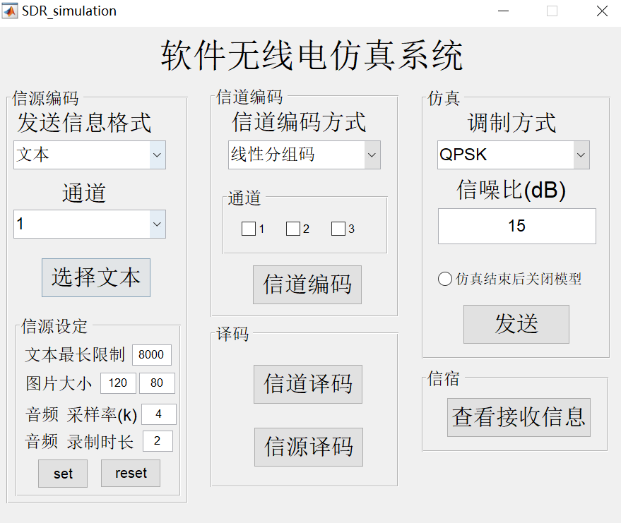
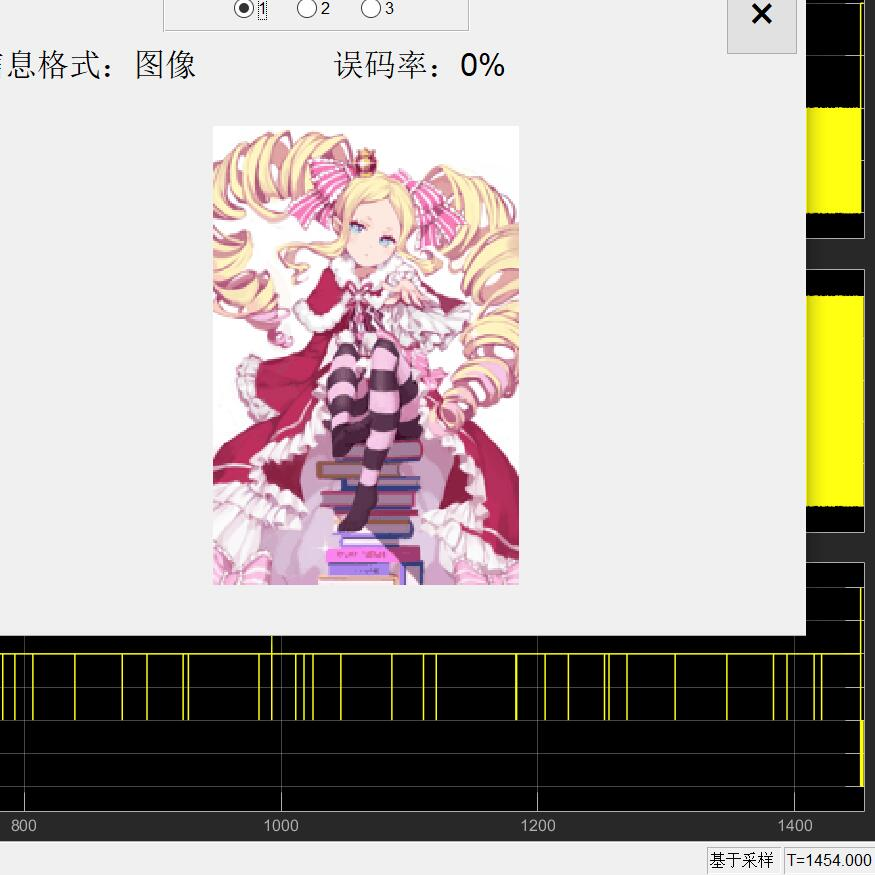

# 软件无线电系统基础设计

## 信源编码

1. 文本：霍夫曼编码
2. 图像：k-means 聚类压缩图像后采用霍夫曼编码
3. 语音：PCM-A律

## 信道编码

1. 线性分组码
2. 卷积码(译码采用 Viterbi 译码)

# 调制方式

1. QPSK
2. 16QAM

## GUI界面

## 分工

信源编码/译码、信道编码/译码、交织/解交织、成帧/帧同步部分在 m 代码中完成（主要由本人完成）。

调制/解调、脉冲成型/匹配滤波、相位同步、 AWGN 信道部分在 simulink 模型中完成（主要由小组其他成员完成）。

GUI 界面由本人设计并实现。

设计原理部分由本人查阅资料撰写。

## 运行

在 SDR_GUI_ver2_2 文件夹下运行 SDR_simulation.m 即可。

## 详情

<a href="https://github.com/BeiYazi0/SDR_simulation/blob/main/%E8%AE%BE%E8%AE%A1%E6%8A%A5%E5%91%8A.pdf" target="_blank">PDF</a>

